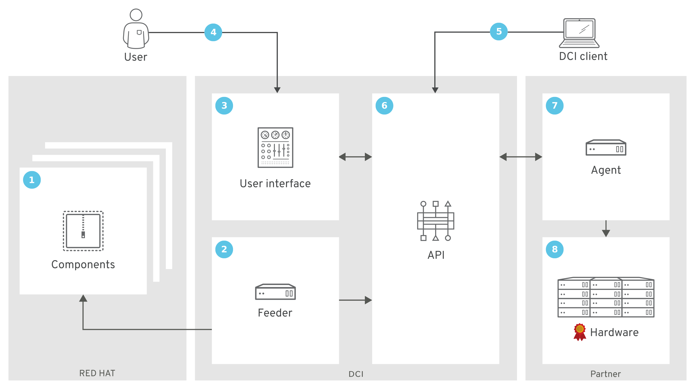

# DCI

The goal of Distributed CI (DCI) is to extend Red Hat production chain on partner platforms.

# Extension of the Red Hat production chain

In order to accelerate the delivery of Red Hat products and bring it closer to upstream releases, the Systems Engineering team work hard on continuous integration. Automation of tests upstream and downstream, QE tests. DCI is the last step of the production chain, extending the testing out to the environments that we care about the most. Our key partners and customers’ use cases. Running different products in their data center, using their gear, their specific configuration, and in some cases adding their own tests. This allows us to know how we are doing on a given release while we are building it. And alerts us when things don’t work out post release when releases come out. Did a change break our internal CI? Did it break on our partner’s environment? Did it break for everyone or just one? Troubleshooting and escalations are still happening, but there’s a lot less chatter about who did what and more about checking logs and fixing things.

# Certification

While we focused on accelerating our delivery of good products, partners had to certify their solution with those products in order to be able to sell it. Because we are already running automated tests to validate the product, it was logical to run the certification tests this way as well. With DCI you can now certify your hardware pre-release and see if bug fixes, security patches are not breaking your certification.

# Workflow

 1. Components are Red Hat products that have passed continuous integration. For OSP for example a component is a tarball with all valid rpm.
 2. Feeder automatically push new components into DCI control server.
 3. Users can manage theirs resources directly threw the user interface: [https://www.distributed-ci.io](https://www.distributed-ci.io)
 4. Any user with a valid DCI subscription on [https://sso.redhat.com](https://sso.redhat.com) can access to the interface.
 5. User can manage theirs resources with DCI client package.
 6. dci-control-server is a REST API which manage all the resources, roles and permissions for DCI.
 7. The agent is an Ansible playbook consuming dci-ansible modules. The agent is build by the partner with the help of Red Hat engineers.
 8. The agent run the installation of the chosen component on partner's infrastructure. At the end of the installation, Red Hat tests and certifications are run.