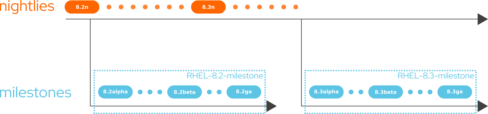
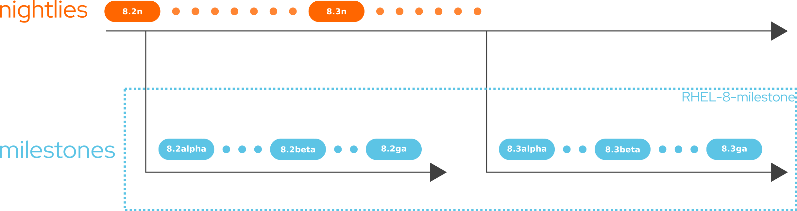
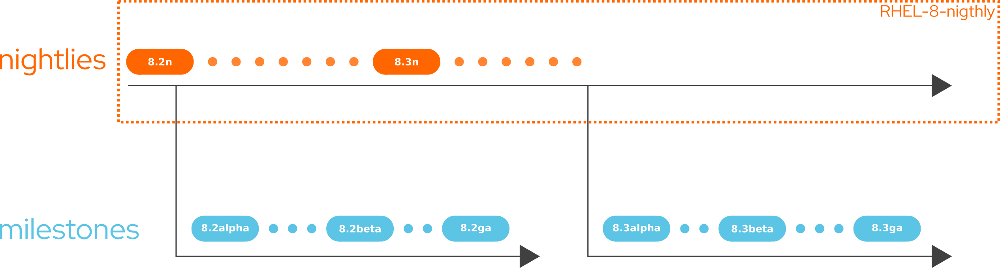

# RHEL support in DCI

If you are using RHEL you are probably familiar with CDN or FTP. CDN contains officially released and supported content. FTP contains pre-release content. The FTP is updated manually and on demand. DCI allows you to get access to pre-release content in an automated way.

## RHEL Compose

Red Hat Enterprise Linux content is in the form of a compose. A compose is a list of RPMs grouped by variants and by architectures.

Here is the list of the different variants available in DCI:

| topic | variants |
|--------|-----------------------------------------------------------------------------------|
| RHEL-7 | Server-NFV, Server-RT, Server-SAP, Server-SAPHANA, Server-optional, Server |
| RHEL-8 | AppStream, BaseOS, CRB, HighAvailability, NFV, RT, ResilientStorage, SAP, SAPHANA |

Here the list of the different architectures available in DCI:

| topic | arches |
|--------|--------------------------|
| RHEL-7 | x86_64, ppc64le |
| RHEL-8 | x86_64, aarch64, ppc64le |

Contact your EPM if you would like a specific architecture not listed here.

## Versions

RHEL major version corresponds to the first digit in the version number. Currently there is 2 major version of RHEL in DCI: version 7 and version 8

RHEL minor version corresponds to the second digit in the version number. E.g. RHEL 7.8 or RHEL 8.2.

## Channels

In RHEL you have different channels. The nightly channel, that contains all the nightlies. And the milestone channel which contains milestones like snapshots, beta, release candidate, etc.

## Topics

A topic is an abstraction to group different Composes together. The name of the topic contains the channel name and the version numbers. E.g. RHEL-8-milestone

If you are using DCI it’s because you need to test RHEL in advance. Depending on your use cases, you should use a specific topic in DCI.

### Use case 1: Be prepared for the next minor release

If the current minor release of Red Hat Enterprise Linux is 8.1, right after General Announcement (GA) you have 6 months to be prepared for the next minor release (RHEL-8.2). Approximately 1 month before GA you have access to the beta of the next minor version.

For certain partners 1 month is too short. DCI allows you to have access to earlier milestones like alpha or snapshot. For this you need to consume the topic name:

RHEL-(7/8/major version number).(0/1/2/minor version number)-milestone

For example RHEL-8.2-milestone will contains milestones for the next unreleased minor version of RHEL-8

> /!\ After the release of RHEL-8.2, this topic is not updated anymore. We only keep the GA components

### Use case 2: Be prepared for future minor releases

If you want to set up a continuous integration pipeline on the milestones with RHEL, and don't care about the minor version you can use the topic

RHEL-(7/8/major version number)-milestone

If the minor version is not specified, you will have access to the next unreleased minor version for the milestone channel.

For example RHEL-8-milestone will contain milestones available internally for the next unreleased minor version of RHEL-8.  Note that when, for example, RHEL-8.2 goes GA, the RHEL-8-milestone topic will contain the RHEL-8.2 GA until the RHEL-8.3 alpha is available.

> /!\ RHEL-8 is a rolling topic. After GA of one minor version you will have access to the first milestone of the next unreleased minor version when it is available.. For example RHEL-8.2-beta1, ..., RHEL-8.2-ga, RHEL-8.3-alpha1, etc.

### Use case 3: Test any Errata advisories or latest kernel in advance

If you want to test any [errata advisories](https://access.redhat.com/support/policy/updates/errata) in advance, or get the latest kernel you can consume the topic RHEL-(7/8)-nightly

> /!\ RHEL-(7/8) are deprecated. They are kept for backward compatibility reasons.

This one will contain the latest tested and qualified available nightly. In this one you will have the latest kernel, the latest errata advisories (the one already released individually or the one that will be aggregated and push in the next minor release)

Depending on where we are in the release of RHEL, you have access to the latest nightly available. So for example RHEL-8-nightly will point to RHEL-8.2.0-nigthly if the current minor release is RHEL-8.1

## FAQ

### How can I access z-stream updates ?

In short: you can’t get those updates in DCI right now because we are focused on pre-ga content. Feel free to tell us, if this is something important for you.

> During the Full Support Phase, qualified Critical and Important Security errata advisories (RHSAs) and Urgent and Selected (at Red Hat discretion) High Priority Bug Fix errata advisories (RHBAs) may be released as they become available.

After GA during the full support phase, Errata advisories are pushed on the CDN as they become available. So the time between an errata is tested and pushed on the CDN is very short. This is why DCI chose to not provide content for specific minor releases after GA.

### Where can some documentation about the Red Hat Enterprise Linux Life Cycle?

[Red Hat Enterprise Linux Life Cycle official document](https://access.redhat.com/support/policy/updates/errata)